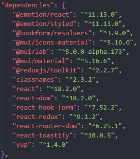
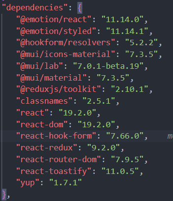
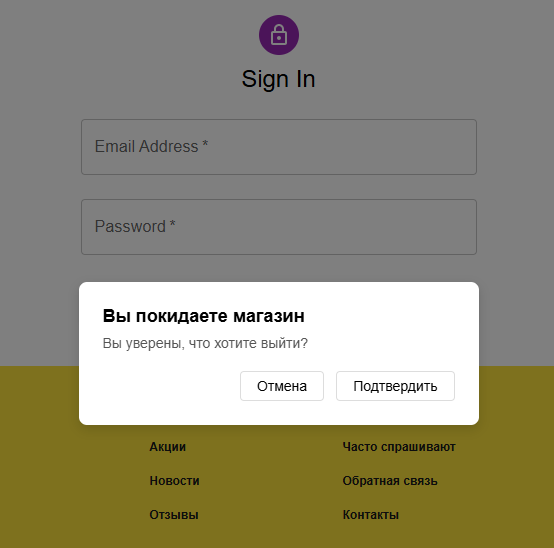
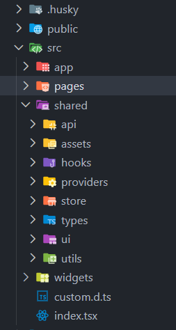
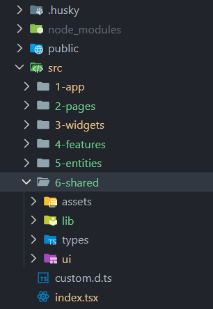
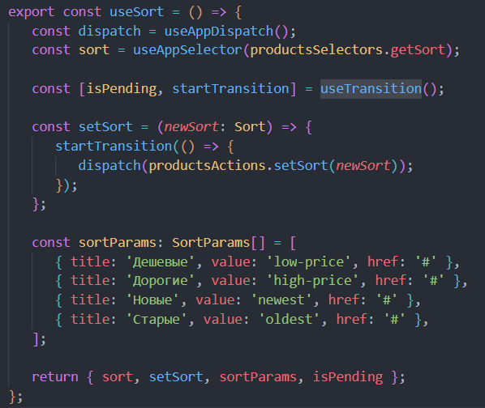
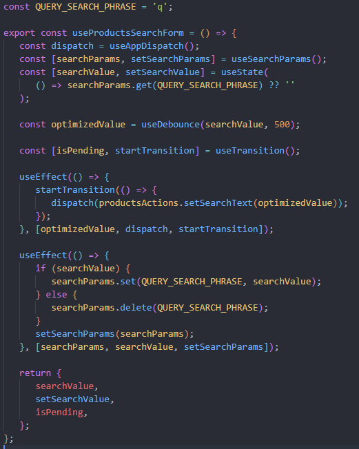
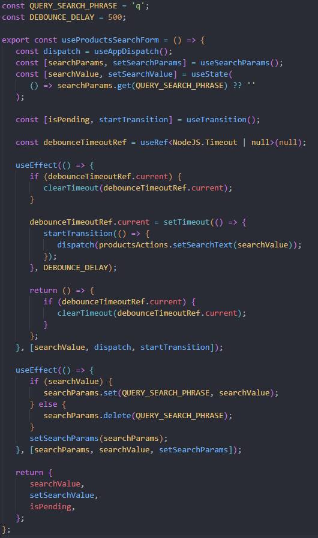
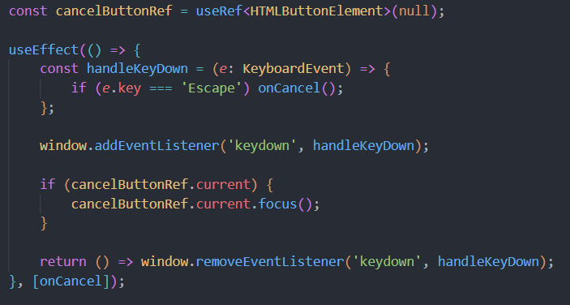
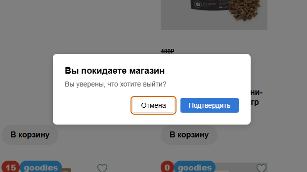

# Итоговый проект

## Что сделано:

1. Обновление библиотек до актуальных версий, устранение ошибок, сборка и запуск проекта.

   Было:
   

   Стало:
   

2. Портальная модалка (через createPortal) с работающим ESC/overlay.

3. Изменение структуры проекта согласно FSD.

   Было:
   

   Стало:
   

4. Внедрение хука useTransition для поиска и сортировки товаров.

5. Использование useRef для хранения состояния и установки автофокуса.

- Замена useDebounce на useRef + setTimeout (например, для избежания зависимости от кастомного хука/библиотеки), useRef хранит ID таймера.

  Было:
  

  Стало:
  

- Хранение в useRef постоянной ссылку на DOM-элемент для установки автофокуса.
  

   

## Чек-лист:

1. Архитектура и структура — 4 балла

- [x] shared/ui только презентационные компоненты, без стора и API (2)
- [x] Изоляция фич по папкам, слои shared/, features/, pages/ соблюдены (1)
- [x] Устранены лишние prop-chains (1)

2. Оптимизация рендеров — 4 балла

- [ ] Profiler: найден hotspot и описан кратко (1)
- [ ] Уместный React.memo (1.5)
- [ ] Точечные useMemo/useCallback для тяжелых вычислений/колбэков в списках (1.5)

3. React.Portal (модалка, доступность) — 3 балла

- [x] Портал работает, #modal-root добавлен, ESC/overlay обрабатываются (2)
- [x] Корректный фокус: установка при открытии, возврат на триггер (1)

4. useRef — 2 балла

- [x] Хранение состояния между рендерами без лишних рендеров (1)
- [x] Автофокус/DOM-интеракция (1)

5. Альтернативная сборка (esbuild/SWC/Vite) — 2 балла

- [ ] Рабочая сборка (1)
- [ ] Сравнение с Webpack в README (время/размер, краткий вывод) (1)

1. React 19 hooks — 3 балла

- [x] Реальный UX-кейс с одним из хуков (2)
- [ ] Обработка ошибок/ресет/оптимистичность (1)

1. README и демо — 2 балла

- [x] «Что сделано» + «Структура папок» (1)
- [x] GIF или скриншот модалки и формы/оптимистичного UI + цифры сравнения сборок (1)

### Обязательные условия (без них — незачет)

- [x] Проект собирается и запускается (любой из сборщиков).
- [x] Портальная модалка (через createPortal) с работающим ESC/overlay.
- [x] Одна фича на React 19 на реальном UX-кейсе.
- [x] README: «Что сделано», «Структура», сравнение сборок (цифры), демо-скрины/гифы.
